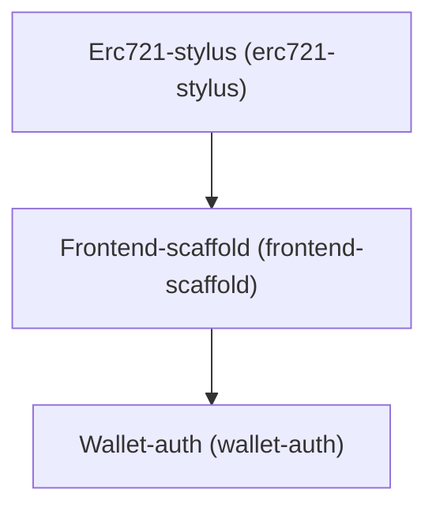

# Architecture

## Dependency Graph

```mermaid
graph TD
  965cd30e["Erc721-stylus (erc721-stylus)"]
  c60a7c94["Frontend-scaffold (frontend-scaffold)"]
  2371855b["Wallet-auth (wallet-auth)"]
  965cd30e --> c60a7c94
  c60a7c94 --> 2371855b
```

## Execution / Implementation Order

1. **Erc721-stylus** (`965cd30e`)
2. **Frontend-scaffold** (`c60a7c94`)
3. **Wallet-auth** (`2371855b`)
